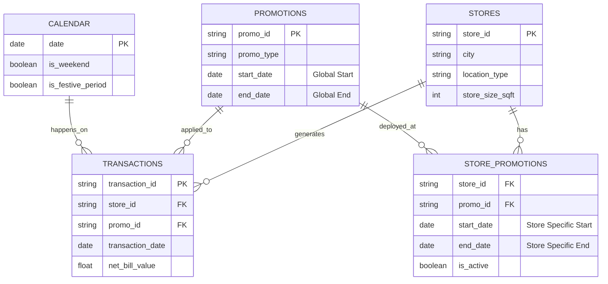

# Relational Schema & Table Relationships

This document outlines the structure and relationships of the retail dataset.

## ER Diagram

## Table Relationships

1.  **STORES ↔ TRANSACTIONS** (One-to-Many)
    *   A single store generates many transactions.
    *   `TRANSACTIONS.store_id` references `STORES.store_id`.

2.  **PROMOTIONS ↔ TRANSACTIONS** (One-to-Many)
    *   A single promotion can be applied to many transactions.
    *   `TRANSACTIONS.promo_id` references `PROMOTIONS.promo_id`.
    *   *Note*: Not all transactions have a promotion (`promo_id` can be NULL).

3.  **STORES ↔ STORE_PROMOTIONS** (One-to-Many)
    *   A store can have multiple active promotions over time.
    *   `STORE_PROMOTIONS.store_id` references `STORES.store_id`.

4.  **PROMOTIONS ↔ STORE_PROMOTIONS** (One-to-Many)
    *   A specific promotion type (e.g., "Diwali Sale") is deployed across multiple stores.
    *   `STORE_PROMOTIONS.promo_id` references `PROMOTIONS.promo_id`.

5.  **CALENDAR ↔ TRANSACTIONS** (One-to-Many)
    *   Each transaction occurs on a specific date found in the calendar.
    *   `TRANSACTIONS.transaction_date` aligns with `CALENDAR.date`.

## Key Constraints
*   **Promo Validity**: A transaction with `promo_id = X` at `store_id = Y` on `date = D` is only valid if there exists a record in `STORE_PROMOTIONS` where:
    *   `store_id = Y`
    *   `promo_id = X`
    *   `start_date <= D <= end_date`
